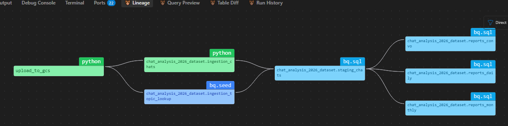
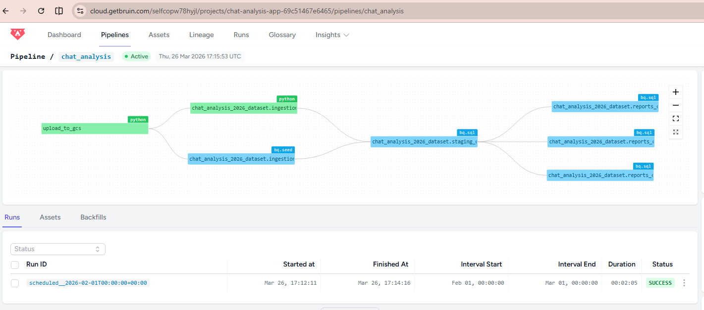
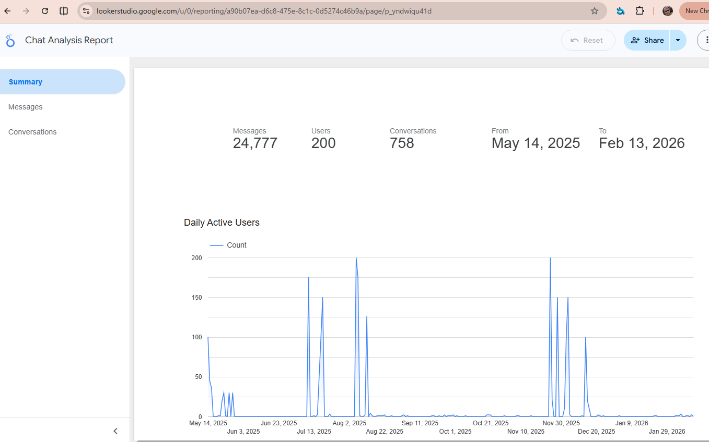

# Data Engineering Zoomcamp Project: Chat Analysis

## Table of Contents
- [Problem Description](#problem-description)
- [Data Sources](#data-sources)
- [Architecture & Tech Stack](#architecture--tech-stack)
- [Clone the Repository](#clone-the-repository)
- [Setting up GCP & Terraform](#setting-up-gcp-with-terraform)
- [Uploading Data to GCS](#uploading-data-to-gcs)
- [Setting up and Using Bruin](#setting-up-and-using-bruin)
- [Pipeline Scheduling & Incremental Loading](#pipeline-scheduling--incremental-loading)
- [Data Quality Checks](#data-quality-checks)
- [Deploying to Bruin Cloud](#deploying-to-bruin-cloud)
- [Dashboard & Optimizations](#dashboard--optimizations)
- [Future Improvements](#future-improvements)

## Problem Description

This project focuses on analyzing chat history data, which consists of chatbot messages generated by 200 demo users. 

**Business Impact:**
By analyzing this chat history, we can understand user engagement, identify peak usage periods, and track the adoption rate of the chatbot. This enables the product and marketing teams to make data-driven decisions on where to invest resources for improving the conversational AI experience.

**Our primary tasks and analytical goals are to:**
- **Process and transform raw chatbot conversation logs.**
- **Track Active Users:** Report the number of active users interacting with the chatbot over time.
- **Calculate Message Volume:** Report the total message volume per user, and by month.
- **Analyze Conversations (Sessionization):** Group individual messages into distinct conversation sessions to track session length, message count per session, and topic-specific engagement.

## Data Sources

The project utilizes two primary data sources extracted from a transactional MySQL/MariaDB database:

1.  **Chat Logs:** Raw conversation logs representing realistic interactions from 200 demo users.
    - `id`: Unique identifier for the chat message entry (Primary Key)
    - `user`: Account name of the user interacting with the chatbot
    - `topic_id`: System identifier for the conversation topic (Foreign Key)
    - `createdAt`: Timestamp indicating when the message was sent
    - `attempt`: Current attempt count for the specific conversation/topic
    - `response`: The chatbot's generated reply
    - `userMessage`: The input message sent by the user

2.  **Topic Lookup:** A lookup table mapping system IDs to human-readable topic names.
    - `topic_id`: Unique identifier for the topic (Primary Key)
    - `topic`: The human-readable name of the topic (e.g., "assessment_test", or "free" for interaction with the chatbot about anything)

**Data Connection:**
In the staging layer of the pipeline, the **Chat Logs** are joined with the **Topic Lookup** table on the `topic_id` field. This enrichment allows the final reports and dashboard to display analysis by human-readable topic names instead of raw system IDs.


## Architecture & Tech Stack

### Architecture
```text
┌──────────────┐     ┌─────────────────────┐
│ Demo Chat    │     │  Bruin Ingestion    │
│ Data Source  ├────►│  (Extract & Load)   │
└──────────────┘     └─────────┬───────────┘
                               │
                               ▼
┌──────────────────────────────────────────┐
│             GCS Data Lake                │
│       gs://your-bucket/raw/chats/        │
└──────────────────────┬───────────────────┘
                       │
                       ▼
┌──────────────────────────────────────────┐
│   BigQuery (Data Warehouse) via Bruin    │
│  - Staging layer (cleaning data)         │
│  - Reporting layer (agg. daily/monthly)  │
│  - Conversation layer (sessionization)   │
│  - Partitioned & Clustered tables        │
└──────────────────────┬───────────────────┘
                       │
                       ▼
┌──────────────────────────────────────────┐
│         Dashboard (Looker Studio)        │
│  - Active users tracking                 │
│  - Message volume over time              │
│  - Conversation analysis                 │
└──────────────────────────────────────────┘
```

### Tech Stack
| Layer | Tool |
|---|---|
| **Cloud Provider** | Google Cloud Platform (GCP) |
| **Infrastructure as Code** | Terraform |
| **Data Lake** | Google Cloud Storage (GCS) |
| **Data Warehouse** | BigQuery (Production) / DuckDB (Local testing) |
| **Ingestion & Orchestration**| Bruin |
| **Transformations** | Bruin (SQL/Python assets) |
| **Visualization** | Looker Studio (or preferred BI tool) |


## Clone the Repository
```bash
git clone https://github.com/Znyiri100/data-engineering-zoomcamp-project-chat_analysis.git
cd data-engineering-zoomcamp-project-chat_analysis
```

## Setting up GCP with Terraform

We will create a new Google Cloud project, link it to an existing billing account, and use Terraform to set up a BigQuery dataset and Google Cloud Storage bucket.

### 1. Prerequisites
- [Google Cloud SDK (gcloud)](https://cloud.google.com/sdk/docs/install) installed and authenticated.
- [Terraform](https://www.terraform.io/downloads) installed.
- A valid Google Cloud Billing Account ID.

### 2. Configure Environment Variables
Copy the `.env.example` file to `.env`:
```bash
cp .env.example .env
```
Fill in the `.env` with: `TF_VAR_project`, `TF_VAR_billing_account_id`. 
Note: The `.env` file is excluded in `.gitignore` so your billing ID and credentials will not be accidentally committed to Git.

> [!IMPORTANT]
> **Bruin IDE Extension Compatibility:**
> The Bruin extension for VS Code/Cursor uses a standard `.env` parser that **does not support bash variable interpolation** (e.g., `${TF_VAR_project}`). 
> It also expects dotenv syntax (`KEY=VALUE`), not `export KEY=VALUE`.
> To avoid `404: Not Found` errors when running queries in the extension, ensure that `PROJECT_ID`, `GCS_BUCKET`, and `GOOGLE_CLOUD_PROJECT` are set as **hardcoded string literals** in your `.env` file.


### 3. Apply Terraform Infrastructure
To set up your environment, Terraform will create your GCP project, link it to billing, enable necessary APIs, create your service account and key, and finally create the GCS Bucket and BigQuery dataset.

Before running Terraform, ensure you authenticate with your personal Google account so Terraform can bootstrap the environment:
```bash
# Login to GCP with ADC (Application Default Credentials)
gcloud auth application-default login
```

1. Navigate to your terraform folder:
   ```bash
   cd terraform
   ```
2. Run the Terraform lifecycle commands (variables are automatically loaded from `TF_VAR_` env vars in `.env`):
   ```bash
   set -a; source ../.env; set +a
   terraform init
   terraform plan
   terraform apply -auto-approve
   ```

Upon a successful apply, Terraform will output your new Project ID, Service Account email, Bucket Name, Dataset ID, and the location of your downloaded `.credentials.json` file.

   ```bash
   Apply complete! Resources: 6 added, 1 changed, 0 destroyed.

   Outputs:

   bigquery_dataset = "chat_analysis_2026_dataset"
   credentials_file = "./../.credentials.json"
   project_id = "chat-analysis-2026"
   service_account_email = "chat-analysis-2026-sa@chat-analysis-2026.iam.gserviceaccount.com"
   storage_bucket = "chat-analysis-2026_bucket"
   ```

Login with newly created service account
   ```bash
   gcloud auth list
   gcloud config set account <service-account-email>
   ```

### 4. Tear Down Infrastructure
If you wish to cleanly tear down the entire environment (including the GCP project, bucket, dataset, and service accounts), you can use Terraform:
```bash
cd terraform
set -a; source ../.env; set +a
terraform destroy -auto-approve
```

## Extracting Data from Local Database (Optional)

The source data resides in a local MySQL/MariaDB Docker container. It is a copy of our production environment, I can't give access to it, so I extracted chat messages for 200 demo users using this script:

```bash
# export data from local database to csv files
python export_data.py
```

This script extracts user chat logs, groups them by month into CSV files (e.g., `2025-05.csv`), and generates a `topic_lookup.csv` file. I have uploaded them to the project github repository under `data/` directory to support reproducing the project.

## Uploading Data to GCS (Automated via Bruin)

The raw CSV chat data must be uploaded to your GCS bucket before BigQuery can process it. 
This is handled automatically by the Bruin pipeline! 

When you trigger the Bruin pipeline, the `upload_to_gcs.py` Python asset runs the `upload_to_gcs.sh` bash script underneath as the first ingestion step. It pulls the data directly from the GitHub repository `data/` directory and uploads each file to `gs://<BUCKET_NAME>/data/` automatically. 

If any of the files already exists, the script will smartly skip downloading and uploading the files.

---

## Setting up and Using Bruin

Bruin is a unified CLI tool for data ingestion, transformation, orchestration, and governance.

### 1. Installation
Install the Bruin CLI:
```bash
curl -LsSf https://getbruin.com/install/cli | sh

# Verify installation
bruin -v
```
*(Optional)* Install the Bruin IDE Extension in VS Code or Cursor, see [Bruin MCP](https://getbruin.com/docs/bruin/getting-started/bruin-mcp.html).

### 2. Validating the Pipeline
Before running, you can validate your pipeline's SQL, Python, and YAML assets for syntax and dependency errors:
```bash
# Navigate to your chat_analysis folder holding the code for Bruin
cd chat_analysis
set -a; source ../.env; set +a
bruin validate ./pipeline/pipeline.yml
```

### 3. Running the Pipeline
To run the full end-to-end pipeline (ingestion -> staging -> reports) for a specific date range, use the `bruin run` command:
```bash
# Run the pipeline for a specific date range with full refresh
bruin run ./pipeline/pipeline.yml --full-refresh --start-date 2026-01-01 --end-date 2026-02-01
# Load all data with full refresh
bruin run ./pipeline/pipeline.yml --full-refresh --start-date 2025-01-01
# full-refresh with variable
bruin run ./pipeline/pipeline.yml --full-refresh --start-date 2025-01-01 --var chat_types='["free", "assessment_test"]'
```

In Bruin, the --full-refresh flag is used to ignore existing data and rebuild an asset (or your entire pipeline) from scratch. It is also needed for the first run to create the assets.

The first step of the pipeline automatically executes `upload_to_gcs.py`, which pulls the CSVs from GitHub and uploads them to your GCS Bucket as part of the ingestion phase. Because it's running with `--full-refresh`, all data will be forcefully re-uploaded and replaced.

### 4. Querying the Results
Once the pipeline has finished running, you can query your data directly through the CLI's `bigquery-default` connection:
```bash
# check sample data
bruin query --connection bigquery-default --query "SELECT * FROM chat_analysis_2026_dataset.staging_chats LIMIT 3"

# check date range
bruin query --connection bigquery-default --query "SELECT MIN(created_at), MAX(created_at) FROM chat_analysis_2026_dataset.staging_chats"

# check row counts, should be the same!
bruin query --connection bigquery-default --query "SELECT count(*)  staging_chats FROM chat_analysis_2026_dataset.staging_chats"
bruin query --connection bigquery-default --query "SELECT sum(MESSAGE_COUNT)  reports_chats_report_daily FROM chat_analysis_2026_dataset.reports_chats_report_daily"
bruin query --connection bigquery-default --query "SELECT sum(MESSAGE_COUNT) reports_chats_report_monthly FROM chat_analysis_2026_dataset.reports_chats_report_monthly"
bruin query --connection bigquery-default --query "SELECT count(*) reports_chats_report_convo from chat_analysis_2026_dataset.reports_chats_report_convo limit 5"
```

### 5. Pipeline in Antigravity


### 6. Features
- **Incremental Processing:** Pipline is parameterized to process only new data (incremental loads) rather than full refreshes.
- **Data Quality Checks:** Integrated data quality tests before they reach the reporting layer.
- **CI/CD Integration:** In Bruin Cloud, updates to the GitHub repository automatically trigger a **code refresh** (deployment). The pipeline itself runs according to its **defined schedule** (e.g., monthly) or when triggered **manually** from the Bruin Cloud UI.

### 7. Key Commands Reference
| Command | Purpose |
|---------|---------|
| `bruin validate <path>` | Check syntax and dependencies without running |
| `bruin run <path>` | Execute pipeline or asset |
| `bruin lineage <path>` | View asset dependencies |
| `bruin query` | Execute ad-hoc SQL queries |
| `bruin connections list` | List configured connections |

For more advanced deployment instructions and tutorials, check out the `chat_analysis/README.md` included in this repository.

## Pipeline Scheduling & Incremental Loading

### 1. Defining the Schedule
The pipeline execution frequency is defined in the pipeline.yml file using the `schedule` key. 

```yaml
schedule: "@monthly" # Runs on the 1st of every month
```

Bruin supports:
- **Presets**: `@hourly`, `@daily`, `@weekly`, `@monthly`.
- **Cron Expressions**: Standard 5-field cron strings (e.g., `0 0 1 * *`).

### 2. Time-Interval Incremental Strategy
To handle large datasets efficiently, this project uses the `time_interval` materialization strategy. This is an **idempotent** approach to incremental loading that ensures data consistency without full refreshes.

**How it works:**
1. **Window Identification**: Bruin identifies the `start_date` and `end_date` for the current execution (e.g., for a monthly run, this is the boundaries of the previous month).
2. **Atomic Replacement**: 
   - Bruin first **deletes** existing data in the target table that falls within this date range using the `incremental_key`.
   - It then **inserts** new data for the same range from your query results.
3. **Granularity**: The `time_granularity: date` setting tells Bruin to treat the `incremental_key` as a `DATE` type (`YYYY-MM-DD`), ensuring correct SQL formatting for the internal `DELETE` filters.

### 3. Monthly Behavior in Bruin Cloud
When deployed to [Bruin Cloud](#deploying-to-bruin-cloud) with a monthly schedule, the platform manages the data lifecycle automatically:

- **Automatic Windows**: For a run triggered on May 1st, Bruin automatically injects window variables for the previous month (e.g., `start_date: 2025-04-01`, `end_date: 2025-05-01`).
- **Safe Re-runs & Backfills**: If a previous month's data needs correction, you can manually re-run that specific interval from the UI. Bruin will safely replace only that month's data, leaving others untouched.
- **Idempotency**: Because it replaces the entire interval, it handles updates and late-arriving data for that period naturally, preventing heartaches over duplicates while ensuring the latest data state.

## Data Quality Checks

Bruin includes a built-in data quality framework that ensures your data is accurate, complete, and consistent. Quality checks are executed immediately after an asset is materialized.

### 1. Built-in Column-Level Checks
These checks are defined directly on columns in your SQL or Python assets:
- **`not_null`**: Ensures no null values exist in the column.
- **`unique`**: Verifies that every value in the column is unique.
- **`positive` / `negative` / `non_negative`**: Validates numeric ranges.
- **`accepted_values`**: Restricts a column to a specific list of values.

### 2. Custom SQL-Level Checks
For more complex validation (e.g., composite keys or business logic), you can define `custom_checks` using SQL. 

### 3. Project Examples
This project implements several checks to maintain high data standards:

*   **Column Validation** in `staging/chats.sql` ensure essential fields like `id` are never null.
*   **Custom Uniqueness** in `reports/chats_report_daily.sql` ensuring each user has exactly one entry per topic per day:
    ```sql
    custom_checks:
      - name: unique_user_topic_day
        query: |
          SELECT count(*)
          FROM (
              SELECT `user`, topic, report_day
              FROM chat_analysis_2026_dataset.reports_chats_report_daily
              GROUP BY 1, 2, 3
              HAVING count(*) > 1
          )
        value: 0
    ```

### 4. Running Checks Manually
You can run all quality checks in your pipeline without re-running the data transformations:
```bash
# Run all checks for the entire pipeline
bruin run --only checks ./pipeline/pipeline.yml
```

## Deploying to Bruin Cloud

[Bruin Cloud](https://cloud.getbruin.com) is a managed platform for running and monitoring your data pipelines. 

### 1. Repository Integration

1. Link your Git repository in the [Bruin Cloud Console](https://cloud.getbruin.com).
2. Bruin Cloud automatically detects your `pipeline.yml` file.

### 2. Managed Connections

Configure your connections (e.g., `bigquery-default`) in the Bruin Cloud UI. Paste your `.credentials.json` content directly into the connection settings to avoid committing secrets to Git.

### 3. Secrets & Connections Configuration

Some assets, specifically the Python ingestion scripts, require environment variables to be set as **Secrets** or **Generic Connections** in the Bruin Cloud UI. These allow the pipeline to dynamically reference your GCP resources without hardcoding them in the source code.

In the **Connections** tab of your Bruin Cloud project, add the following parameters a Generic Secret connection type:

| Key | Example Value | Description |
|---|---|---|
| `PROJECT_ID` | `chat-analysis-2026` | Your GCP Project ID |
| `GCS_BUCKET` | `chat-analysis-2026_bucket` | Your GCS Bucket Name |

These parameters are automatically injected as environment variables when the pipeline runs, ensuring the `upload_to_gcs.py` asset can correctly identify its destination.

For a complete walkthrough, see the [Deploying to Bruin Cloud](https://github.com/DataTalksClub/data-engineering-zoomcamp/blob/main/05-data-platforms/notes/05-bruin-cloud.md).

### 4. Troubleshooting from CLI

You can use the Bruin CLI to troubleshoot your Bruin Cloud pipelines:

```bash
# Set your Bruin Cloud API Key
export BRUIN_CLOUD_API_KEY=XXX

# List projects
bruin cloud projects list

# List pipeline errors
bruin cloud pipelines errors

# List runs for a specific project and pipeline
bruin cloud runs list --project-id chat-analysis-app-69c51467e6465 --pipeline chat_analysis

# List assets for a specific project and pipeline
bruin cloud assets list --project-id chat-analysis-app-69c51467e6465 --pipeline chat_analysis
```




## Dashboard & Optimizations

### Data Warehouse Optimizations
To ensure cost-efficiency and fast query performance in BigQuery, the resulting reporting tables are optimized using:
- **Partitioning:** The `staging_chats`, `reporting_chats_report_daily`, `reporting_chats_report_monthly`, and `reports_chats_report_convo` tables are partitioned by their respective date or timestamp columns (`created_at`, `report_day`, `report_month`) to limit the amount of data scanned.
- **Clustering:** The tables are clustered by `user` and `topic` fields (and additionally `conversation_id` for the conversations report) for faster grouped aggregations by these dimensions.

### Dashboard
*[Looker Studio dashboard](https://lookerstudio.google.com/reporting/a90b07ea-d6c8-475e-8c1c-0d5274c46b9a)*

The dashboard visualizes:
- **Active User Trends:** Line charts showing number of active users interacting with the chatbot over time.
- **Messages:** Pie charts showing number of messages per user, and a stack bar chart showing number of messages per month for each user.
- **Conversation Insights:** A table with conversations filtered by date, user, and topic.



## Future Improvements
- expand reports to include more insights, e.g. add report with conversation classification, e.g. [learn, fun, other…]
- adapt Alexey's [chatgpt-data-viewer](https://github.com/alexeygrigorev/chatgpt-data-viewer) to browse chat messages
- add connectors to source live data from production mysql database and/or the application API, currently data is served in scrubbed csv files due to privacy concerns
